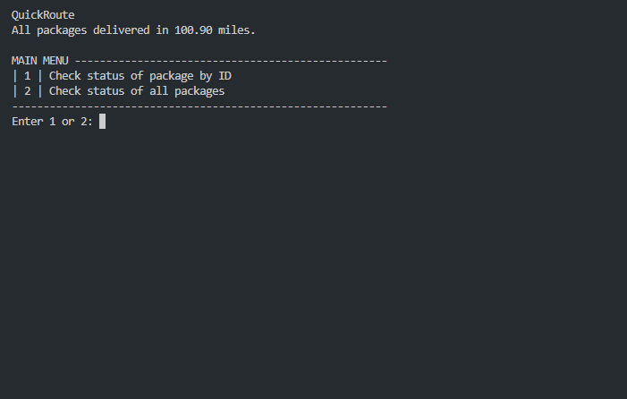

# Traveling Salesman
<p align="center">
    
</p>
An application that finds the shortest possible delivery route within specified constraints. Packages are distributed between three trucks & two drivers, and trucks are required to deliver all packages while traveling under a combined 140 miles.

<details>
  <summary>#### Constraints</summary>
  * Each truck can carry a maximum of 16 packages, and the ID number of each package is unique.
  * The trucks travel at an average speed of 18 miles per hour and have an infinite amount of gas with no need to stop.
  * There are no collisions.
  * Three trucks and two drivers are available for deliveries. Each driver stays with the same truck as long as that truck is in service.
  * Drivers leave the hub no earlier than 8:00 a.m., with the truck loaded, and can return to the hub for packages if needed. 
  * The delivery and loading times are instantaneous, i.e., no time passes while at a delivery or when moving packages to a truck at the hub (that time is factored into the calculation of the average speed of the trucks).
  * There is up to one special note associated with a package.
  * The delivery address for package #9, Third District Juvenile Court, is wrong and will be corrected at 10:20 a.m. WGUPS is aware that the address is incorrect and will be updated at 10:20 a.m. However, WGUPS does not know the correct address (410 S State St., Salt Lake City, UT 84111) until 10:20 a.m.
  * The distances provided in the WGUPS Distance Table are equal regardless of the direction traveled.
  * The day ends when all 40 packages have been delivered.
</details>

## 🔗 Demo

## 🔧 Installation
1. Download the ZIP folder
2. Unzip the folder
3. Install [Python](https://www.python.org/downloads/)
4. Open the ```Main.py``` file in your IDE
5. Press 'run'

## 👩🏻‍💻 Navigation
1. Follow the prompts in the terminal
  * Enter '1' to check the status of a package by ID
    * Enter 'Package ID' (1-40)
    * Enter time HH:MM:SS
    * See delivery status of specified package
  * Enter '2' to check the status of all packages
    * Enter time HH:MM:SS
    * See delivery status of all packages

## ⚡️Technologies Used
* Python
